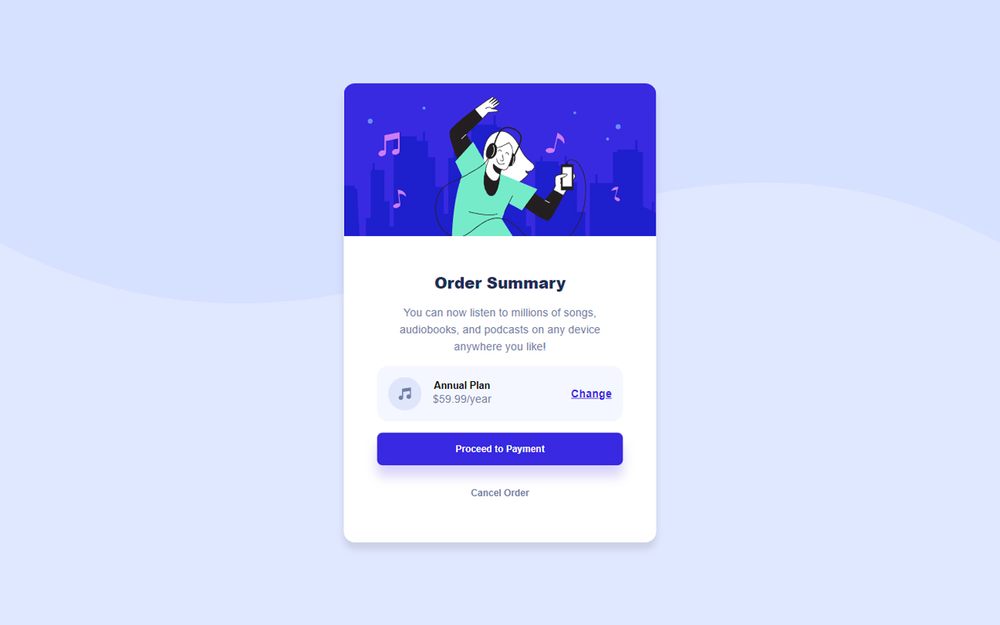

# Frontend Mentor - Order summary card solution

This is a solution to the [Order summary card challenge on Frontend Mentor](https://www.frontendmentor.io/challenges/order-summary-component-QlPmajDUj). Frontend Mentor challenges help you improve your coding skills by building realistic projects.

## Overview

### The challenge

Users should be able to:

- See hover states for interactive elements

### Screenshot

### Links

- Solution URL: [https://github.com/aneeshkr-me/order-summary-component](https://github.com/aneeshkr-me/order-summary-component)
- Live Site URL: [https://aneeshkr-me.github.io/order-summary-component/](https://aneeshkr-me.github.io/order-summary-component/)

## Author

- Website - [Aneesh Rajendran](https://aneeshkr.me)
- Frontend Mentor - [@aneeshkr-me](https://www.frontendmentor.io/profile/aneeshkr-me)
